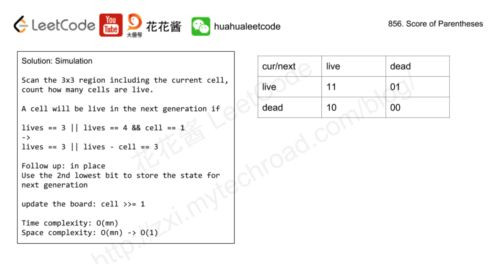

# 289. Game of Life

Since the board has ints but only the 1-bit is used, we can use the 2-bit to store the new state. At the end, replace the old state with the new state by shifting all values one bit to the right.



```java
class Solution {
    public void gameOfLife(int[][] board) {
        int m = board.length, n = board[0].length;
        for (int i = 0; i < m; ++i) {
            for (int j = 0; j < n; ++j) {
                int lives = 0;
                // scan 3x3 area
                for (int y = Math.max(0, i - 1); y < Math.min(m, i + 2); ++y) {
                    for (int x = Math.max(0, j - 1); x < Math.min(n, j + 2); ++x) {
                        lives += board[y][x] & 1;
                    }
                }
                if (lives == 3 || lives - board[i][j] == 3) {
                    board[i][j] |= 2;
                }
            }
        }

        for (int i = 0; i < m; i++) {
            for (int j = 0; j < n; j++) {
                board[i][j] >>= 1;
            }
        }
    }
}
```
